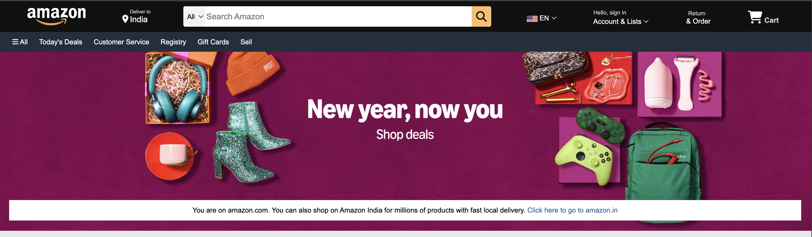
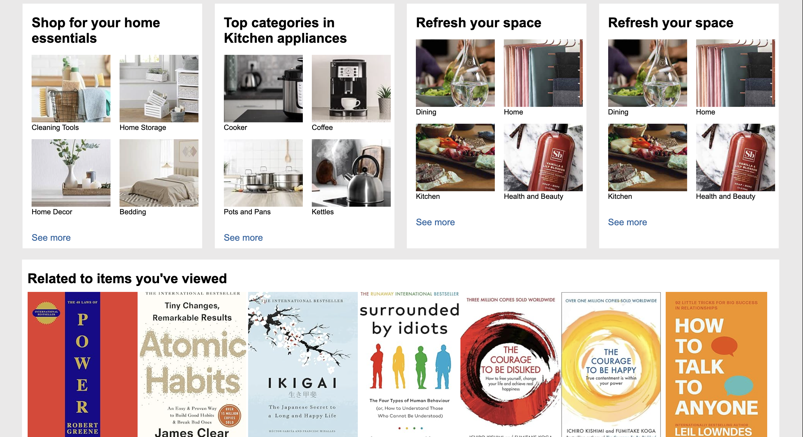
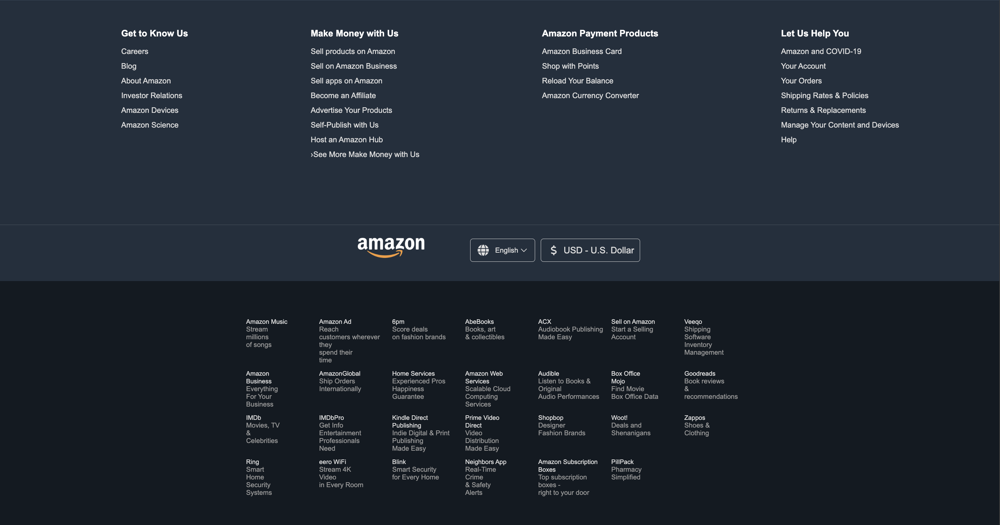

# 🌟 Amazon Clone Website  

A visually appealing and responsive e-commerce website inspired by Amazon, developed using **HTML** and **CSS**. This project showcases a clean layout, reusable CSS styles, and essential components of a modern e-commerce site.  

---

## 🔥 Key Features  

- **Responsive Navigation Bar**: Features dynamic hover effects and seamless logo integration.  
- **Hero Section**: A visually captivating background with an adaptive layout.  
- **Product Showcase**: Organized product grids for an intuitive browsing experience.  
- **Footer**: Informative and functional, with navigation and quick links.  
- **Reusable CSS Styles**: Clean, modular code for consistent and maintainable design.  

---

## 🛠️ Tech Stack  

- **HTML**  
- **CSS**  

---

## 🚀 How to Get Started  

1. **Clone the Repository**:  
   ```bash  
   git clone https://github.com/PrabhakaranVijay/Amazon-Home-Page-Clone.git 
   ```   

2. **Open the Project**:  
   Navigate to the project folder and open the `index.html` file in any modern web browser.  

3. **Explore the Features**:  
   - A responsive and interactive navigation bar.  
   - An eye-catching hero section.  
   - A neatly organized product display grid.  
   - An informative and functional footer.  

---

## 🎨 Screenshots  

Take a closer look at the design and layout:  

- **Navigation Bar**  
    

- **Product Categories**  
    

- **Footer**  
    

- **Stay Connected Section**  
    

---

## 🤝 Contributions  

We welcome contributions, bug reports, and suggestions to make this project better!  

### Steps to Contribute:  
1. **Fork the Repository**.  
2. **Create a New Branch**:  
   ```bash  
   git checkout -b feature-name  
   ```  
3. **Commit Your Changes**:  
   ```bash  
   git commit -m "Add your message here"  
   ```  
4. **Push to the Branch**:  
   ```bash  
   git push origin feature-name  
   ```  
5. **Open a Pull Request** and provide details about your contribution.  

---

## 🌐 Live Demo  

Experience the project live:  
[Amazon Clone Live Demo](https://prabhakaranvijay.github.io/Amazon-Home-Page-Clone/)  

---
